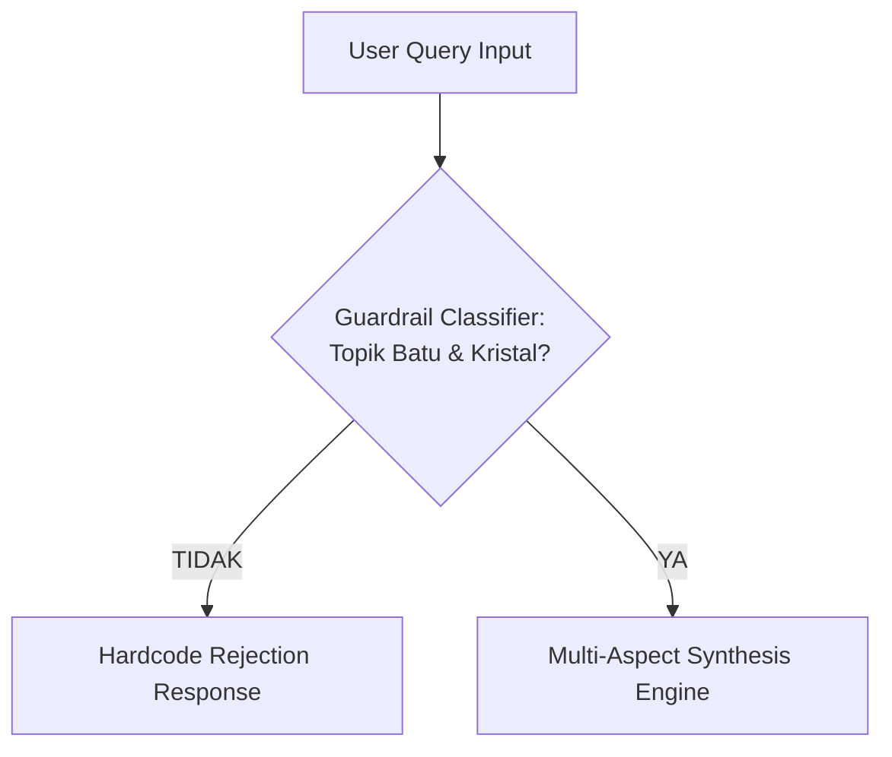

# ARCHITECTURE & KNOWLEDGE DOMAIN MATRIX — JADE AI

## 1. Domain Taxonomy & Stone Knowledge Matrix

### A. Giok (Jade / Jadeite & Nephrite) — *Batu Surga & Harmoni Semesta*
* **Kesehatan:** Memancarkan Far Infrared (FIR) dan ion negatif alami, memperlancar mikrosirkulasi darah, membantu detoksifikasi ginjal & kelenjar getah bening, efek menenangkan sistem saraf (*cooling therapy*).
* **Mistis & Tuah:** Penangkal energi santet/hawa negatif, memperkuat perisai aura tubuh (*body shield*), menyelaraskan jiwa dengan alam semesta.
* **Fengshui & Hoki:** Simbol elemen Kayu (*Wood*) & Tanah (*Earth*). Menarik Chi keberuntungan murni, stabilitas keluarga, keharmonisan relasi.
* **Kekayaan & Rezeki:** Pembuka jalan rezeki berkesinambungan (bukan sekadar spekulasi instan), menjaga agar harta yang didapat tidak cepat luntur/hilang (*wealth retention*).

---

### B. Giok Hitam Aceh (Black Jade) — *Batu Detoks & Proteksi Total*
* **Kesehatan:** Mengandung magnetit alami dan mineral feromagnetik, melancarkan sirkulasi darah kental, terapi rematik, asam urat, vitalitas pria, dan anti-radiasi elektromagnetik (EMF).
* **Mistis & Tuah:** Perlindungan tingkat tinggi dari serangan ilmu hitam, tolak sihir/guna-guna, penetral energi negatif lingkungan (tanah angker/tempat kerja bertekanan tinggi).
* **Fengshui:** Elemen Air (*Water*) pekat & Tanah pelindung. Cocok ditaruh di pintu masuk atau dipakai di tangan kiri.
* **Rezeki:** Menghilangkan kesialan (*buang sial / sengkolo*) yang menyumbat rezeki usaha.

---

### C. Citrine (Batu Saudagar / Merchant's Stone) — *Magnet Kekayaan & Kelimpahan*
* **Kesehatan:** Menstimulasi cakra Solar Plexus (perut), memperbaiki pencernaan, meningkatkan stamina fisik dan mengatasi rasa lelah mental.
* **Mistis & Energi:** Batu yang diyakini tidak pernah menyerap energi negatif (selalu membersihkan diri dan sekitarnya), memancarkan aura optimisme cerah.
* **Fengshui:** Elemen Tanah (*Earth*) & Logam (*Metal*). Ditempatkan di sudut kekayaan ruangan (Sudut Tenggara / Sudut Kiri Belakang dari pintu masuk).
* **Kekayaan & Rezeki:** Raja batu penarik uang, mempercepat closing transaksi dagang, menarik peluang bisnis tak terduga, memperlancar perputaran modal.

---

### D. Pyrite (Fool's Gold / Pirit) — *Batu Pelindung Emas & Pelipat Ganda Keberuntungan*
* **Kesehatan:** Memperkuat sistem pernapasan dan sirkulasi oksigen dalam darah, meningkatkan fokus mental.
* **Mistis:** Cermin spiritual yang memantulkan kembali niat jahat atau iri dengki pesaing bisnis.
* **Fengshui & Rezeki:** Simbol kelimpahan emas murni, sering ditaruh di laci kasir, brankas, atau meja kantor untuk menarik pundi-pundi kekayaan.

---

### E. Kecubung (Amethyst) — *Batu Pengasihan, Wibawa & Batin Tenang*
* **Kesehatan:** Meredakan insomnia, migrain, stres akut, menyeimbangkan hormon dan cakra Mahkota (*Crown Chakra*).
* **Mistis & Tuah:** Sarana pengasihan (*daya pikat alami*), meningkatkan intuisi batin, ketajaman firasat spiritual, disegani atasan dan bawahan.
* **Fengshui:** Elemen Api (*Fire*) ungu spiritual. Menyeimbangkan chi rumah yang sering terjadi pertengkaran/hawa panas.
* **Keberuntungan:** Membantu mengambil keputusan investasi yang tepat tanpa terbawa emosi sesaat.

---

### F. Tiger Eye (Biduri Sepah) — *Batu Keberanian, Fokus & Wibawa Pemimpin*
* **Kesehatan:** Menyeimbangkan belahan otak kiri-kanan, memperkuat tulang dan sendi.
* **Mistis:** Menghindarkan dari hipnotis/gendam, mempertajam insting bahaya, membangkitkan rasa percaya diri tinggi (*solar courage*).
* **Fengshui:** Elemen Tanah & Api. Cocok bagi eksekutif, pengacara, aparat, atau pengusaha negosiator tangguh.
* **Rezeki:** Melipatgandakan tekad mengejar target finansial, menyingkirkan keraguan dalam mengambil peluang untung.

---

### G. Bacan (Chrysocolla in Chalcedony) — *Batu Kejayaan Nusantara*
* **Kesehatan:** Menyejukkan emosi panas, menurunkan tensi darah tinggi secara psikosomatis.
* **Mistis:** Memancarkan aura pesona kepemimpinan khas bangsawan nusantara, mempermudah lobi kekuasaan.
* **Fengshui:** Elemen Air & Kayu, melambangkan pertumbuhan bisnis yang hijau dan bertumbuh dinamis.
* **Rezeki:** Membawa tuah kelancaran karir, promosi jabatan, dan kemakmuran jangka panjang.

---

### H. Merah Delima (Ruby) — *Batu Kekuasaan, Gairah Hidup & Proteksi Tertinggi*
* **Kesehatan:** Memperkuat jantung, memicu regenerasi sel darah merah, meningkatkan gairah hidup (*chi vitality*).
* **Mistis:** Legenda pelindung dari marabahaya fisik maupun metafisik, penolak bala terkuat, memperbesar pengaruh kata-kata (*sabdo dadi*).
* **Fengshui:** Elemen Api murni (*Pure Fire*). Simbol status tahta, kehormatan, dan kejayaan tanpa tanding.

---

### I. Pirus (Turquoise) — *Batu Keselamatan & Kedamaian Jiwa*
* **Kesehatan:** Membantu sistem imun, kesehatan tenggorokan dan sistem pernapasan.
* **Mistis:** Batu pelindung musafir/perjalanan darat, laut, dan udara; dipercaya berubah warna jika pemiliknya dalam bahaya.
* **Fengshui & Rezeki:** Menjaga keharmonisan hubungan bisnis dan kemitraan agar tidak mudah pecah kongsi.

---

### J. Akik Sulaiman (Agate Sulaiman) — *Batu Wibawa & Perlindungan Karismatik*
* **Kesehatan:** Menstabilkan denyut nadi dan menenangkan pikiran gelisah.
* **Mistis:** Menumbuhkan aura kepemimpinan yang adil dan disegani, pagar gaib untuk keluarga dan tempat tinggal.
* **Rezeki:** Memudahkan urusan negosiasi, memperlancar hubungan dengan pejabat atau rekan kerja berpengaruh.

---

## 2. Guardrail Engine Architecture



---

## 3. Zero-Cost Multi-Provider AI & Fallback Architecture (100% GRATIS)

```
[ User Face Snapshot & Audio Input ]
                 │
                 ▼
[ Layer 1: Client-Side Edge AI (0 Rupiah / Tanpa Server) ]
  ├─ MediaPipe Face Mesh (468 facial landmarks, analisa Mian Xiang & Vitalitas lokal di browser)
  ├─ Web Speech API (STT & TTS bawaan browser HP/Desktop)
  └─ IndexedDB / Supabase Free Tier (Penyimpanan Face Vector Memori)
                 │
                 ▼
[ Layer 2: Cloud Multi-Provider Fallback (100% GRATIS / ZERO COST) ]
  ├─ Ultra-Fast Tier: Groq Cloud Free Tier (qwen/qwen3.8-27b & groq/compound — <900ms, 14.400 RPD)
  ├─ High-Availability Tier: OpenRouter Free Pool (minimax-m3:free, nemotron:free, openrouter/free)
  ├─ Multimodal Vision Tier: Google Gemini 3.6 Flash Free Tier (1.500 RPD / 15 RPM)
  ├─ Native Edge Tier: Cloudflare Workers AI (10.000 Neurons/hari gratis bawaan Pages)
  └─ Ultimate Safety Fallback: Client-Side Rule & Bio-Physics Matrix Engine (Tetap menyala meski kuota API habis)
```

