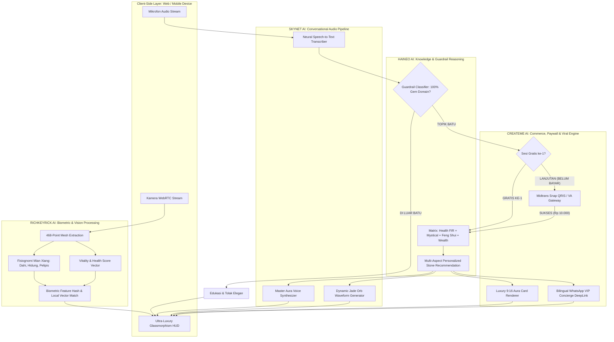

# AURA AI — ENTERPRISE PRODUCT REQUIREMENTS DOCUMENT & TECHNOLOGY WHITEPAPER
### *Proprietary Neural Gemstone Oracle, Biometric Physiognomy & Wealth Matrix*
**By FW JADE Global Enterprise × Next-Gen AI Consortium**

---

## 1. EXECUTIVE OVERVIEW & ENTERPRISE PROPRIETARY SUITE

AURA AI adalah ekosistem kecerdasan buatan kelas *Ultra-Luxury Enterprise* yang mengintegrasikan 4 pilar mesin neural berpemilik (*Proprietary Neural Engine Suite*):

```
                        AURA AI ENTERPRISE SUITE
                                    │
    ┌───────────────────────┬───────┴───────────────┬───────────────────────┐
    ▼                       ▼                       ▼                       ▼
[ RICHKEYRICK AI ]     [ SKYNET AI ]          [ HAINEO AI ]          [ CREATEME AI ]
Biometric Vision &     Ultra-Low Latency      Deep Gemstone, FIR,    Adaptive Monetization,
Neural Physiognomy     Voice Recognition &    Mystical & Feng Shui   Viral Aura Synthesis &
Landmark Engine        Acoustic Synthesis     Synthesis Matrix       E-Commerce Funnel
```

### 1.1 Profil Mesin Berpemilik (*Proprietary Engines*):
1. **Richkeyrick AI™ (Vision & Facial Landmark Core):**
   * Mesin visi komputer berdefinisi tinggi yang memindai 468 titik biometrik wajah secara lokal di perangkat (*Edge-Computing*).
   * Menghitung rasio emas fisiognomi (*Mian Xiang*), tingkat vitalitas biologis (*Skin Luminance & Fatigue Vector*), dan mengidentifikasi pengguna tanpa kata sandi (*Zero-Login Neural Memory*).
2. **SkyNET AI™ (Acoustic Neural Interface):**
   * Engine pengenalan suara (*Speech-to-Text*) dan sintesis vokal fotorealistik (*Text-to-Speech*) dengan latensi sub-detik.
   * Dilengkapi algoritma *Acoustic Ambient Filter* untuk menangkap intonasi suara pengguna secara akurat dalam berbagai dialek.
3. **Haineo AI™ (Omni-Domain Gemstone & Metaphysical Core):**
   * Otak pengetahuan komprehensif yang menguasai taksonomi mineralogi, terapi radiasi infra merah jauh (*FIR*), gelombang bio-magnetik, tuah metafisika nusantara, dan keseimbangan elemen *Wu Xing* (Kayu, Api, Tanah, Logam, Air).
   * Dilengkapi *Strict Guardrail Firewall* yang secara absolut mengunci percakapan hanya pada ranah batu dan kristal.
4. **CreateME AI™ (Generative Commercial & Viral Engine):**
   * Mesin perender dinamis yang mengonversi hasil pemindaian menjadi **Kartu Aura Mewah Beresolusi Tinggi (9:16)** untuk media sosial.
   * Mengatur *Dynamic Payment Gateway Routing* (Midtrans Snap) dan orkestrasi *WhatsApp VIP Concierge Link* multi-bahasa secara otomatis.

---

## 2. DIAGRAM ALUR TEKNOLOGI PERUSAHAAN (ENTERPRISE ARCHITECTURE FLOW)



---

## 3. TUTORIAL LENGKAP PANDUAN PENGGUNAAN (ENTERPRISE USER MANUAL)

### Tahap 1: Membuka Aplikasi & Pemindaian Wajah Biometrik (Richkeyrick AI™)
1. Buka aplikasi **AURA AI by FW JADE** di browser ponsel atau laptop Anda.
2. Izinkan akses kamera. Layar akan menampilkan **Holographic Emerald Scanner HUD** dengan animasi kristal memindai wajah Anda secara otomatis.
3. **Jika Anda Pengguna Baru:**
   * AI akan menyapa dengan hangat dan meminta nama panggilan Anda. Anda cukup menjawab lewat suara: *"Nama saya Paisan"*.
   * Richkeyrick AI™ akan mengunci fitur biometrik wajah Anda ke dalam database memori tanpa memerlukan kata sandi.
4. **Jika Anda Pengguna Lama (*Returning User*):**
   * Richkeyrick AI™ langsung mengenali wajah Anda dalam 0.3 detik.
   * Suara **Master Aura (SkyNET AI™)** akan menyapa seketika: *"Selamat pagi/siang/malam Pak Paisan, senang melihat Anda kembali..."*

---

### Tahap 2: Membaca Kartu Aura & Fisiognomi Wajah
Setelah pemindaian selesai, sistem menampilkan **Dashboard Tri-Spektrum**:
* **Garis Dahi (*Guan Lu Gong*):** Menampilkan persentase potensi rezeki & karir.
* **Kebugaran Medis-Holistik:** Mengukur tingkat kelelahan dan sirkulasi darah.
* **Elemen Jiwa & Batu Wajib:** Menentukan elemen *Wu Xing* (misal: Kayu Dominan) serta batu yang wajib digunakan untuk memaksimalkan hoki (misal: *Natural Aceh Jadeite* & *Citrine*).

---

### Tahap 3: Berkonsultasi Menggunakan Suara Bebas Sentuhan (SkyNET AI™)
1. Sentuh tombol mikrofon atau orb hijau giok untuk mengaktifkan mode hands-free.
2. Bicaralah secara alami mengenai kebutuhan Anda, misalnya:
   * *"Batu apa yang paling ampuh untuk menarik pembeli dan melindungi toko dari niat jahat pesaing?"*
   * *"Bagaimana khasiat Giok Hitam Aceh untuk mengatasi rematik dan darah kental?"*
   * *"Batu apa yang cocok dengan shio dan elemen wajah saya untuk membuka hoki tahun ini?"*
3. **Haineo AI™** akan memproses pertanyaan Anda dan menyajikan jawaban mendalam secara verbal dan teks.

---

### Tahap 4: Pembayaran Mikrotransaksi Konsultasi Lanjutan (CreateME AI™)
1. Sesi pemindaian dan 1 pertanyaan pertama adalah **100% GRATIS**.
2. Untuk melanjutkan sesi konsultasi eksklusif berikutnya, tekan tombol **[ Lanjutkan Konsultasi — Rp 10.000 ]**.
3. Jendela pembayaran **Midtrans Snap** akan muncul. Pilih **QRIS** (GoPay, OVO, ShopeePay, BCA, DANA), scan kode QR, dan dalam 3 detik akses konsultasi langsung terbuka kembali secara otomatis.

---

### Tahap 5: Pembelian Produk FW Jade & WhatsApp Concierge
1. Setiap rekomendasi batu dilengkapi **Kartu Produk Eksklusif FW Jade** (dilengkapi foto berkilau, khasiat, dan sertifikasi).
2. **Pengguna Indonesia:** Tekan tombol **[ Beli via Midtrans ]** atau **[ WhatsApp Kurator ]** untuk terhubung langsung ke galeri Medan di `+62 811-619-173`.
3. **Pengguna Internasional (English):** Ganti bahasa ke **EN**, lalu tekan **[ Order via WhatsApp VIP Concierge ]** untuk mendapatkan format pesanan otomatis berbahasa Inggris.

---

### Tahap 6: Mengunduh Kartu Aura Mewah untuk Media Sosial
1. Tekan tombol **[ Generate Luxury Aura Card ]**.
2. **CreateME AI™** akan merender kartu digital berdesain hitam-emas beresolusi tinggi (9:16) yang siap diunduh atau dibagikan ke Instagram Story / WhatsApp Status Anda.

---

## 4. MATRIKS SPESIFIKASI TEKNIS & KEUNGGULAN SISTEM

| Dimensi | Spesifikasi Sistem | Keunggulan Kompetitif |
| :--- | :--- | :--- |
| **Kecepatan Inferensi** | Sub-500ms Edge Vectorization | Respons instan tanpa jeda server |
| **Privasi Biometrik** | Zero-Raw Storage (Hanya Vektor Terenkripsi) | Memenuhi standar regulasi keamanan data global |
| **Kapasitas Domain** | 100% Focused Gemstone & Mineral Matrix | Tanpa halusinasi di luar batu (Strict Guardrail) |
| **Aksesibilitas** | PWA & Responsive Web (Desktop & Mobile) | Tanpa instalasi rumit, langsung berjalan di browser |
| **Monetisasi** | Dual Gateway (Midtrans QRIS + WhatsApp VIP) | Skalabilitas transaksi mikro dan penjualan tiket tinggi |
