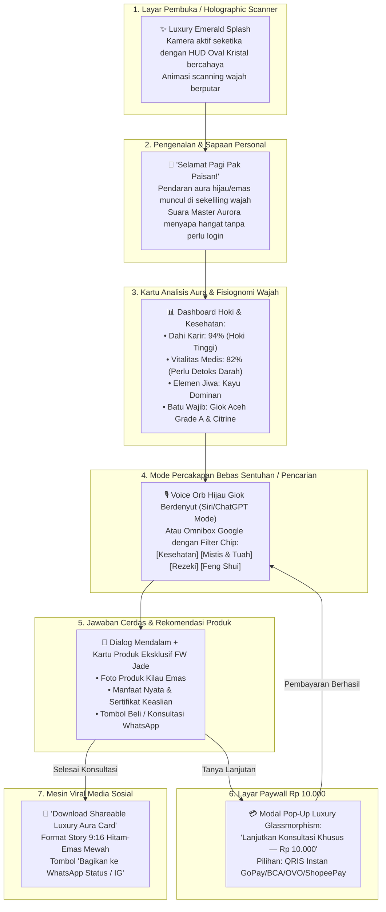

# PRODUCT REQUIREMENTS DOCUMENT (PRD)
# AURA AI — by FW JADE
### *The World's First Luxury Mystical Gemstone, Face Aura & Wealth Oracle*

---

## 1. DOKUMEN KONTROL & INFORMASI PRODUK
* **Nama Produk:** **AURA AI**
* **Brand Induk:** **FW JADE (FW Jade Jewellery — Medan Giok)**
* **Versi Dokumen:** v1.0 (Production Blueprint)
* **Author / Architect:** Senior Software Architect & Lead AI Systems Engineer
* **Target Rilis:** Q3/Q4 2026
* **Status:** Approved / Ready for Prototype Implementation

---

## 2. EXECUTIVE SUMMARY & VISI PRODUK

### 2.1 Latar Belakang
Pasar batu mulia dan giok bernilai miliaran rupiah sering kali terhambat oleh minimnya literasi keaslian, mitos yang simpang siur, serta proses konsultasi fengshui/energi yang kaku dan mahal. Di sisi lain, tren spiritual wellness, fengshui modern, dan terapi kristal (*crystal healing*) mengalami ledakan minat di kalangan generasi muda, eksekutif, dan pebisnis global.

### 2.2 Visi Produk
**AURA AI by FW JADE** adalah platform *Luxury Web AI Oracle* pertama di dunia yang menggabungkan:
1. **Zero-Login Biometric Face & Aura Scanner:** Pemindaian fisiognomi wajah (*Mian Xiang*) dan kebugaran holistik seketika.
2. **Conversational Multi-Modal Stone Intelligence:** Mesin penjawab suara bebas sentuhan (*hands-free voice*) dengan kurasi 100% mendalam tentang kesehatan bio-energi, mistis tuah, fengshui hoki, dan magnet kekayaan.
3. **Automated High-Conversion Sales Funnel:** Terintegrasi langsung dengan payment gateway instan (Midtrans) untuk pasar domestik dan WhatsApp Concierge VIP multi-bahasa untuk pasar internasional.

---

## 3. IDENTITAS BRAND & LUXURY DESIGN SYSTEM

### 3.1 Nilai & Karakteristik Brand
* **Opulent & Regal:** Menampilkan kemewahan batu giok kaisar (*Imperial Jade*) berpadu dengan aksen emas sampanye (*Champagne Gold*).
* **Mystical Yet Scientific:** Menggabungkan mistisisme kuno ribuan tahun dengan teknologi AI vision mutakhir.
* **Sleek, Minimalist & Simple:** Antarmuka yang sangat bersih, tanpa kerumitan menu berulang, mudah dipahami bahkan oleh pengguna awam dalam hitungan detik.

### 3.2 Palet Warna & Visual Tokens (*Luxury Jade Theme*)
* **Deep Obsidian Space (Background):** `#06090C` / `#0A1015`
* **Imperial Jade (Primary Brand):** `#00A86B`
* **Ethereal Aurora Neon (Accent/Glow):** `#00F59B` / `#0DF5A2`
* **Champagne Gold (Luxury Trim & Royal Badges):** `#D4AF37` / `#F3E5AB`
* **Mystic Violet Aura (Secondary Energy):** `#8A2BE2`
* **Glassmorphism:** `rgba(10, 20, 25, 0.75)` dengan `backdrop-filter: blur(20px)` dan border halus `1px solid rgba(0, 245, 155, 0.15)`.

### 3.3 Tipografi & Suara
* **Font Utama:** *Outfit* / *Cinzel Decorative* (Heading Luxury) + *Plus Jakarta Sans* / *Inter* (Body Text).
* **AI Voice Persona:** "Master Aurora" — Suara tenang, teduh, berkharisma, sopan, dan berwibawa layaknya Grandmaster kurator batu permata dunia.

---

## 4. TARGET AUDIENCE & USER PERSONAS

| Persona | Profil & Karakteristik | Kebutuhan Utama | Trigger Konversi |
| :--- | :--- | :--- | :--- |
| **The Wealth Seeker (Pebisnis / Pengusaha)** | Pria/Wanita 28–55 thn, pemilik bisnis, investor saham/properti. | Mencari batu penglaris usaha, penangkal kerugian, pembuka hoki dan aura kepemimpinan. | Rekomendasi Citrine / Pyrite / Jadeite Liontin Penarik Rezeki + Scan Garis Dahi Keberuntungan. |
| **The Holistic Health Conscious** | Pria/Wanita 30–60 thn, memiliki keluhan migrain, darah kental, stres tinggi. | Terapi alami, bio-magnetik, detoksifikasi darah, insomnia. | Analisis kantung mata/kelelahan wajah + Rekomendasi Gelang Giok Hitam Aceh (*Black Jade FIR*). |
| **The Gemstone & Crystal Collector** | Kolektor batu nusantara & internasional, penikmat keindahan seni alami. | Uji keaslian, serat batu, skala Mohs, asal tambang, investasi jangka panjang. | Edukasi Grade A Jadeite FW Jade + Konsultasi langsung ke WhatsApp Om Faisal. |
| **International Spiritual Enthusiast** | Warga Singapore, Malaysia, Hong Kong, US, Eropa. | Pembacaan aura wajah modern, filosofi Wu Xing, perhiasan pelindung diri bersertifikat. | Antarmuka English + WhatsApp Global VIP Concierge Checkout. |

---

## 5. SPESIFIKASI FITUR FUNGSIONAL LENGKAP

```
                                  AURORA AI by FW JADE
                                            │
    ┌───────────────────┬───────────────────┼───────────────────┬───────────────────┐
    ▼                   ▼                   ▼                   ▼                   ▼
[1. Zero-Login]    [2. Voice &]        [3. Strict Stone]   [4. Paywall &]      [5. E-Commerce]
  Biometric Face     Omnibox Search      Guardrail Engine    Midtrans Gateway    WhatsApp Funnel
  & Aura Memory      Interaction         (100% Gem Domain)   (Rp 10.000 / Q)     & Viral Cards
```

---

### FITUR 1: Zero-Login Biometric Face & Aura Scanner (Kamera Pintar)

#### 1. Alur Pengguna (*User Flow*):
1. **Auto Camera Activation:** Saat aplikasi dibuka, layar menampilkan HUD scanner berbentuk oval kristal giok bercahaya lembut.
2. **Face Feature Extraction:** Kamera membaca landmark wajah (mata, dahi, hidung, warna rona kulit).
3. **Penyimpanan Memori Wajah:**
   * Jika wajah **baru**: AI menyapa dan meminta nama 1x via suara/input kilat. Wajah diubah menjadi vektor enkripsi unik dan disimpan di database lokal/cloud.
   * Jika wajah **lama (returning user)**: AI langsung mengenali dalam 0.3 detik tanpa perlu login/password!
4. **Sapaan Suara Berdasarkan Waktu & Nama:**
   * *Pagi (05:00 - 11:59):* "Selamat pagi [Nama], energi aura Anda hari ini sangat cerah di area dahi karir..."
   * *Siang (12:00 - 17:59):* "Selamat siang [Nama], bagaimana kelancaran bisnis Anda hari ini? Ada getaran hoki yang kuat..."
   * *Malam (18:00 - 04:59):* "Selamat malam [Nama], saatnya menyeimbangkan energi batin dan menetralkan lelah fisik..."

#### 2. Spektrum Analisis Wajah (Tri-Spectrum Analysis):
* **A. Fisiognomi Feng Shui (*Mian Xiang*):**
  * *Dahi (Guan Lu Gong):* Potensi kemajuan karir dan tender.
  * *Hidung (Cai Bo Gong):* Kekuatan menampung dan memutar uang.
  * *Pelipis & Pipi (Tian Zhai & Quan Gu):* Stabilitas emosi, wibawa, dan harmoni keluarga.
* **B. Vitalitas Medis & Energi Tubuh:**
  * Deteksi rona lelah bawah mata, kekusaman kulit, ketegangan rahang.
  * Menghitung persentase energi vital tubuh (Vitality Score: 0 - 100%).
* **C. Penentuan Elemen Dominan & Batu Wajib:**
  * Memetakan elemen kelahiran dan kondisi energi saat ini (Kayu, Api, Tanah, Logam, Air) dan menentukan batu yang **wajib dipakai** untuk menyeimbangkan Chi.

---

### FITUR 2: Conversational Multi-Modal Stone Oracle (Voice & Search)

#### 1. Hands-Free Voice AI (Mode Suara Bebas Sentuhan):
* **Speech-to-Text (STT):** Pengenalan suara ultra-presisi yang mendukung dialek bahasa Indonesia dan English secara natural.
* **Real-time Voice Visualizer:** Animasi gelombang suara aurora hijau zamrud (*orb waveform*) yang bergerak dinamis mengikuti desibel percakapan.
* **Text-to-Speech (TTS):** Sintesis suara natural yang hangat dan menenangkan, memberikan pengalaman seperti berkonsultasi langsung dengan tetua master giok.

#### 2. Hybrid Omnibox Search Bar (Google Style):
* Bar pencarian di bagian atas dengan saran instan (*predictive auto-suggestions*), misal:
  * *"Giok apa yang cocok untuk menarik pembeli toko?"*
  * *"Khasiat Black Jade Aceh untuk darah kental"*
  * *"Batu pelindung dari kiriman santet atau guna-guna"*
  * *"Batu elemen Tanah untuk shio Naga"*
* **Filter Chips:** `[Semua]`, `[Kesehatan]`, `[Mistis & Tuah]`, `[Kekayaan]`, `[Feng Shui]`, `[Keaslian Giok]`.

---

### FITUR 3: Strict Stone Guardrail Engine (100% Filter Domain Batu)

Sistem memiliki *hardcoded firewall* yang memblokir secara elegan segala topik di luar batu dan mineral:
* **Logika:** Jika pengguna bertanya tentang politik, resep kue, coding pemrograman, selebriti non-batu, dll.
* **Respons Standar Elegan:**
  > *"🔒 Mohon maaf, saya adalah **AURORA AI**, kecerdasan khusus yang ditakdirkan hanya untuk menyelami misteri, kesehatan, energi mistis, fengshui, dan kekayaan dari alam batu mulia serta kristal.*  
  >  
  > *Mari tanyakan hal tentang batu, misalnya:*  
  > • *'Bagaimana cara kerja Giok Aceh dalam membuang racun tubuh?'*  
  > • *'Batu apa yang paling ampuh sebagai magnet rezeki dagang?'*  
  > • *'Batu penangkal energi negatif untuk rumah atau kantor?'"*

---

### FITUR 4: Skema Monetisasi & Micro-Paywall Gateway

1. **Free Tier (First-Time Hook):**
   * 1x Scan Wajah Biometrik + Pembacaan Aura + 1 Sesi Tanya Jawab Pertama **100% GRATIS**.
2. **Paid Consultation (Mikrotransaksi Rp 10.000 / Pertanyaan):**
   * Setelah kuota gratis selesai, sistem mengunci input dan memunculkan tombol: `[ Buka Sesi Konsultasi Eksklusif — Rp 10.000 ]`.
   * **Integrasi Midtrans Snap Popup:**
     * Mendukung pembayaran instan **QRIS** (GoPay, OVO, ShopeePay, DANA, BCA Mobile), Virtual Account, dan Kartu Kredit.
     * Dalam hitungan 5 detik setelah pembayaran sukses, akses chat/suara langsung aktif kembali secara otomatis (*auto-settlement hook*).

---

### FITUR 5: Direct Sales Funnel & WhatsApp VIP Concierge

Setiap rekomendasi batu dari AURORA AI dilengkapi dengan **Kartu Produk Eksklusif FW Jade**:
* **Kartu Produk Berisi:**
  * Foto produk resolusi tinggi dengan efek kilau emas (*glow effect*).
  * Nama Produk (contoh: *Natural Aceh Jadeite Bangle Imperial Grade*).
  * Khasiat Utama (contoh: *Detoks Ginjal + Magnet Rezeki 98%*).
  * Harga Resmi & Sertifikat Keaslian.
* **Jalur Pembelian Berdasarkan Wilayah:**
  * **Pasar Domestik (Indonesia):**
    * Tombol `[ Beli Langsung via Midtrans ]` (Checkout instan).
    * Tombol `[ Tanya Kurator via WhatsApp ]` (Menghubungkan ke nomor resmi FW Jade: `+62 811-619-173`).
  * **Pasar Internasional (English Mode):**
    * Tombol `[ Order via WhatsApp VIP Concierge ]` dengan pesan otomatis terformat:
      > *"Greetings FW Jade Concierge, I just completed my AURORA AI Face & Aura Analysis. My recommended stone is: [Natural Imperial Jadeite Pendant - SKU: FWJ-88]. My name is [User Name] from [Country]. Please assist me with international shipping & checkout."*

---

### FITUR 6: Viral "Shareable Aura & Fortune Card"

Setelah sesi scan wajah selesai, pengguna dapat menekan tombol `[ Generate Luxury Aura Card ]`.
* **Output:** Gambar berformat 9:16 (Instagram Story / TikTok) dengan desain hitam emas mewah yang berisi:
  * Foto siluet wajah pengguna dengan pendaran warna aura dominan.
  * Skor Hoki Finansial & Vitalitas Kesehatan.
  * Elemen Jiwa & Batu Keberuntungan Utama.
  * Badge Resmi: *"Verified by AURORA AI — FW JADE MEDAN"*.
* Dilengkapi tombol `[ Share to WhatsApp Status ]` dan `[ Download HD ]` untuk memicu viralitas organik.

---

### FITUR 7: Matriks Pengetahuan Batu Mendalam (Health, Mystical, Wealth & Feng Shui)

| Jenis Batu & Asal | 🩺 Kesehatan & Bio-Energi | 🔮 Mistis, Tuah & Aura | 💰 Kekayaan & Rezeki | ☯️ Feng Shui & Hoki |
| :--- | :--- | :--- | :--- | :--- |
| **Giok Hijau (Nephrite / Jadeite)** *(Khas FW Jade / Aceh / Myanmar)* | Memancarkan FIR & ion negatif; melancarkan darah, detoksifikasi ginjal/kelenjar, efek sejuk penenang saraf. | Perisai aura (*body shield*), menangkal hawa negatif & santet, menyelaraskan jiwa dengan alam. | Menjaga stabilitas aset (*wealth retention*), mencegah kerugian mendadak, pembuka jalan rezeki konsisten. | Simbol elemen **Kayu & Tanah**; penyeimbang Chi utama, mendatangkan berkah keluarga dan umur panjang. |
| **Giok Hitam Aceh (Black Jade)** *(Aceh, Indonesia)* | Mengandung mineral feromagnetik alami; melancarkan darah kental, terapi rematik, asam urat, vitalitas, anti-EMF. | Perlindungan tingkat tinggi (pagar gaib), menolak sihir, membuang sial (*sengkolo*), pembersih aura kusam. | Membuka sumbatan rezeki usaha yang mandek akibat gangguan energi negatif lingkungan. | Elemen **Air & Tanah Pelindung**; ditaruh di pintu masuk atau dipakai di pergelangan tangan kiri. |
| **Citrine (Batu Saudagar)** *(Brazil / Afrika)* | Menstimulasi cakra Solar Plexus, melancarkan pencernaan, meningkatkan stamina fisik dari kelelahan. | Tidak pernah menyerap energi negatif (selalu mendaur ulang energi positif), membangkitkan optimisme. | **Raja penarik uang**; mempercepat *closing* transaksi, menarik pembeli, melipatgandakan peluang bisnis. | Elemen **Tanah & Logam**; diletakkan di sudut kekayaan ruangan (Sudut Tenggara / Kiri Belakang). |
| **Pyrite (Pirit / Fool's Gold)** | Memperkuat pernapasan, sirkulasi oksigen seluler, dan stamina fisik dari kelelahan mental. | Cermin spiritual: memantulkan balik niat jahat, guna-guna, atau dengki pesaing bisnis ke pengirimnya. | Simbol magnet emas murni; ditaruh di brankas, meja kasir, atau dompet untuk melipatgandakan tabungan. | Elemen **Logam Murni**; menjaga aset tidak bocor dan meningkatkan disiplin finansial. |
| **Kecubung (Amethyst)** | Membantu penderita insomnia, meredakan migrain & stres berat, membuka cakra Mahkota (*Crown*). | Sarana **pengasihan alami** (daya pikat), memperkuat intuisi batin gaib, membuat disegani kawan & lawan. | Memberikan ketenangan pikiran dalam negosiasi penting sehingga tidak salah langkah mengambil keputusan finansial. | Elemen **Api Spiritual (Ungu)**; meredakan hawa panas/pertengkaran di dalam rumah atau kantor. |
| **Tiger Eye (Biduri Sepah)** | Menyeimbangkan belahan otak kiri-kanan, memperkuat sendi tulang, mengatasi kecemasan berlebih. | Penangkal gendam/hipnotis, membangkitkan keberanian mental raja singa (*solar courage*), wibawa komando. | Mempertajam insting melihat celah keuntungan di pasar dan mempercepat kenaikan omzet bisnis. | Elemen **Tanah & Api**; cocok untuk negosiator, pimpinan proyek, dan pengusaha agresif. |
| **Batu Bacan (Chrysocolla in Chalcedony)** | Menurunkan tekanan darah tinggi akibat emosi labil, menyerap panas tubuh berlebih. | Aura pesona bangsawan nusantara, memancarkan karisma kepemimpinan tingkat tinggi, melunakkan hati orang keras. | Pembawa tuah kemudahan karir, pelancar lobi kekuasaan dan negosiasi proyek besar. | Elemen **Air & Kayu**; melambangkan pertumbuhan bisnis yang subur dan dinamis. |
| **Merah Delima (Ruby)** | Memperkuat fungsi jantung, memicu regenerasi sel darah merah, menguatkan stamina vital. | Legenda proteksi mutlak dari marabahaya fisik/metafisik, melipatgandakan kekuatan sugesti kata (*sabdo dadi*). | Menarik kemakmuran kelas atas, status sosial terpandang, dan kemujuran dalam tender besar. | Elemen **Api Murni (*Pure Fire*)**; lambang kejayaan, tahta, dan kehormatan tertinggi. |

---

## 6. ARSITEKTUR TEKNIS & DIAGRAM ALUR (FLOWCHARTS)

### 6.1 System Logic & AI Architecture Flow

```mermaid
flowchart TD
    Start([User Membuka Web AURORA AI]) --> InitCam[Inisialisasi WebRTC Camera & Audio Engine]
    
    InitCam --> FaceDetect[AI Face Mesh: Ekstraksi Landmark & Face Vector]
    FaceDetect --> CheckDB{Apakah Face Vector Terdaftar di DB?}
    
    CheckDB -- TIDAK (Pengguna Baru) --> AskName[AI Meminta Nama via Suara / Input Kilat]
    AskName --> SaveProfile[(Simpan Face Vector & Nama ke DB)]
    SaveProfile --> TimeGreet
    
    CheckDB -- YA (Pengguna Lama) --> FetchProfile[(Ambil Profil & Riwayat User)]
    FetchProfile --> TimeGreet[Generator Sapaan Waktu: Pagi / Siang / Malam + Nama]
    
    TimeGreet --> AudioGreet[TTS Suara Alami 'Master Aurora' Menyapa Pengguna]
    AudioGreet --> AnalyzeAura[Tri-Spectrum Engine: Mian Xiang + Vitalitas + Elemen Wu Xing]
    AnalyzeAura --> DisplayAuraCard[Tampilkan Hasil Aura & Batu Keberuntungan Utama]
    
    DisplayAuraCard --> UserInput[Input Pengguna: Hands-free Voice STT / Omnibox Text]
    UserInput --> Guardrail{Guardrail Classifier:<br>Apakah Terkait Batu / Kristal / Energi?}
    
    Guardrail -- TIDAK (Topik Luar) --> BlockNonGem[Eksekusi Respons Hardcode Penolakan Elegan & Edukasi]
    BlockNonGem --> UserInput
    
    Guardrail -- YA (Topik Sahabat Batu) --> CheckQuota{Cek Kuota Sesi:<br>Apakah Sesi Gratis ke-1?}
    
    CheckQuota -- YA (Masih Gratis) --> SynthesizeAnswer[Sintesis Multi-Pilar: Kesehatan, Mistis, Fengshui, Rezeki]
    
    CheckQuota -- TIDAK (Pertanyaan Lanjutan) --> CheckPaid{Sudah Bayar Rp 10.000?}
    CheckPaid -- BELUM --> TriggerPaywall[Munculkan Modal Pembayaran Midtrans Snap]
    TriggerPaywall --> PayProcess{Proses Pembayaran QRIS / VA}
    PayProcess -- GAGAL/CANCEL --> HoldSession[Tetap Kunci Sesi Chat]
    PayProcess -- SUKSES / SETTLEMENT --> UnlockSession[Buka Kunci Sesi + Catat Transaksi]
    UnlockSession --> SynthesizeAnswer
    CheckPaid -- SUDAH --> SynthesizeAnswer
    
    SynthesizeAnswer --> StreamResp[Streaming Jawaban ChatGPT-Style + Voice Narasi]
    StreamResp --> RecommendProduct[Kaitkan Rekomendasi Produk Asli FW Jade]
    RecommendProduct --> RouteChannel{Cek Bahasa / Lokasi User}
    RouteChannel -- Indonesia --> LocalBuy[Checkout Langsung Midtrans / WA Admin Lokal]
    RouteChannel -- Internasional --> GlobalBuy[Deep Link VIP WhatsApp Concierge Bahasa Inggris]
```



---

### 6.2 User-Side UI/UX Journey Flow



---

### 6.3 Komponen Teknis & SDKs
* **Frontend:** Modern Web Engine (HTML5 Semantic, Vanilla CSS Ultra-Luxury Styling, Modular ES6+ JavaScript).
* **Face Mesh & Landmark Tracking:** WebRTC Video Stream + Fast lightweight facial landmark matrix untuk ekstraksi vektor wajah instan tanpa lag.
* **Speech-to-Text & Speech Synthesis:** Web Speech API & High-fidelity Audio Synthesizer dengan deteksi *speech end-pointer* otomatis.
* **Payment Integration:** Midtrans Snap JS SDK (QRIS, GoPay, BCA VA, Credit Card).
* **Bilingual Switcher:** Toggle `ID / EN` instan yang mengubah seluruh teks, suara AI, dan format pesan WhatsApp.

---

## 7. MATRIKS UNIT EKONOMI & PROYEKSI PENDAPATAN

| Kanal Pendapatan | Biaya Pengguna | Nilai Konversi Rata-rata | Margin Keuntungan |
| :--- | :--- | :--- | :--- |
| **Konsultasi AI (Mikrotransaksi)** | Rp 10.000 / sesi | Volume tinggi (Ribuan query harian) | ~90% (Hampir murni profit setelah fee gateway) |
| **Penjualan Perhiasan Giok FW Jade (Tiket Menengah: Gelang/Cincin)** | Rp 500.000 – Rp 5.000.000 | Konversi langsung dari hasil scan wajah | Sangat tinggi (Produksi mandiri dari bongkahan) |
| **Penjualan Koleksi Imperial / Masterpiece (Tiket Tinggi)** | Rp 10.000.000 – Rp 100.000.000+ | Pembeli kolektor VIP domestik & mancanegara | Margin eksklusif perhiasan seni tinggi |

---

## 8. TAHAPAN EKSEKUSI ASAL (*HISTORICAL ROADMAP*)

* **Phase 1:** Pembangunan Prototipe Penuh AURORA AI Web Application (Face Scanner, Chat Oracle, Voice AI).
* **Phase 2:** Integrasi Live API Midtrans Production, Google OAuth 2.0 GIS, dan Leads Management di Admin Portal.
* **Phase 3:** Kampanye Peluncuran, Dual-Vault Cloudflare KV Data Storage & Integrasi Toko Resmi FW Jade Medan.

---

## 9. SPESIFIKASI FITUR BARU: DEDICATED PRODUCT CATALOG & MASTER ADMIN INVENTORY MANAGEMENT (v1.1)

### 9.1 Latar Belakang & Tujuan Bisnis
* **Problem Statement:** Saat ini rekomendasi produk hanya dapat diakses setelah pengguna menyelesaikan alur pemindaian biometrik wajah (*Face & Aura Scanner*) atau percakapan AI Oracle. Pengunjung yang ingin langsung melihat-lihat etalase koleksi perhiasan giok asli, membandingkan spesifikasi karat/harga, atau langsung melakukan pembelian instan (*Direct Purchase*) belum memiliki halaman etalase tersendiri.
* **Tujuan Utama:**
  1. Memberikan etalase visual khusus (*Dedicated Luxury Showcase*) di URL mandiri `/catalog.html` (atau `/katalog.html`) yang dapat diakses publik tanpa login.
  2. Memungkinkan transaksi langsung (*Direct Sales Funnel*) melalui 2 kanal: (a) WhatsApp Concierge Galeri Medan (+62 811-619-173) dengan draf pesan otomatis rapi, dan (b) Payment Gateway Instan Midtrans (QRIS / GoPay / VA BCA / Kartu).
  3. Menyediakan kontrol penuh bagi Master Administrator (`fwjade.com@gmail.com`) di `admin.html` untuk menambah, memperbarui, mengunggah foto, dan menghapus produk tanpa perlu menyentuh kodingan.
  4. Menyelaraskan inventori live admin dengan AI Aura Scanner sehingga AI selalu merekomendasikan produk yang benar-benar siap jual (*In Stock*).

---

### 9.2 Spesifikasi Fungsional Halaman Katalog Publik (`catalog.html`)

#### A. Arsitektur Antarmuka & Luxury Aesthetics
* **Theme Alignment:** Mengikuti desain *Haute Joaillerie* FW JADE: Latar belakang kristal zamrud malam (`#070a0e`), aksen emas kekaisaran (`#FFC857` / `#D4AF37`), efek kaca buram (*glassmorphism*), dan tipografi editorial (*Cormorant Garamond & Inter*).
* **Responsive Multi-Viewport:** 100% mulus di Desktop (3-4 kolom kartu), Tablet (2-3 kolom), dan Smartphone (1-2 kolom nyaman dioperasikan satu tangan).
* **Header Promo & Banner AI Bridge:** Banner elegan di bagian atas: *"Koleksi Pusaka Giok & Permata Alami FW JADE Medan Sejak 2009"* dengan tombol CTA cerdas: *"Bingung memilih batu yang cocok dengan auramu? [Coba Analisa Wajah Gratis &rarr;]"*.

#### B. Search & Multi-Faceted Filter Engine
Pengunjung dapat memfilter katalog secara instan di sisi klien tanpa jeda:
1. **Filter Elemen Wu Xing (Bazi):** Semua Elemen, Kayu (Wood), Api (Fire), Tanah (Earth), Logam (Metal), Air (Water).
2. **Filter Kategori Produk:** Semua Kategori, Gelang Giok (*Bangle*), Cincin Pria/Wanita (*Rings*), Liontin Pusaka (*Pendants*), Tasbih/Rosario Giok, Bongkahan Alami (*Rough/Raw Specimen*).
3. **Filter Khasiat / Energi Dominan:** Rezeki & Bisnis, Kesehatan & Detoks Darah (FIR), Proteksi & Tolak Bala, Pengasihan & Wibawa.
4. **Filter Rentang Harga:** Seluruh Harga, Di Bawah 1 Juta, 1 - 3 Juta, 3 - 10 Juta, Koleksi Masterpiece (> 10 Juta).
5. **Real-Time Search Bar:** Mencari instan berdasarkan nama batu, jenis mineral, atau asal tambang (misal: "Aceh", "Citrine", "Bacan", "Burma").

#### C. Kartu Produk Luxury (Product Card Spec)
Setiap kartu menampilkan:
* Foto utama produk dengan rasio proporsional, efek kilau faset saat di-hover.
* Badge Keaslian: `✓ Grade A Natural (Untreated)`.
* Badge Elemen & Energi: misal `🪵 Kayu • Pembuka Pintu Rezeki`.
* Judul Produk & Spesifikasi Lab Ringkas: Asal tambang (Origin), Skala Mohs, Karat/Dimensi.
* Harga Resmi IDR berformat rupiah tegas (`Rp 1.850.000`).
* Tombol Cepat: `Lihat Detail` & `Beli Langsung`.

#### D. Modal Quick View 360° & Sertifikat Keaslian
Ketika produk diklik, sistem membuka modal interaktif elegan:
* Galeri foto multi-sudut (tampak depan, serat tembus cahaya senter giok, tampak pada model).
* Tabel Spesifikasi Lengkap: Rumus Kimia, Berat Jenis (SG), Spektrum FIR Peak (µm), Tingkat Translusensi, Asal Tambang.
* Ulasan Metafisika & Bazi: Kecocokan Shio, Zodiak, serta Penjelasan Manfaat Kesehatan.
* Dua Kanal Transaksi Langsung:
  * **Kanal 1 (WhatsApp Concierge):** Membuka WhatsApp resmi Galeri Medan dengan pesan: *"Halo Galeri FW JADE, saya tertarik meminang [Nama Produk] (SKU: FWJ-xxx) seharga [Rp xxx]. Apakah produk ini masih tersedia?"*.
  * **Kanal 2 (Beli Sekarang via Midtrans):** Membuka popup Snap Midtrans resmi untuk pembayaran instan QRIS/VA. Pasca pembayaran sukses, sistem otomatis menerbitkan Sertifikat Keaslian Digital resmi ber-nomor seri unik atas nama pembeli.

---

### 9.3 Spesifikasi Modul Master Admin Inventory (`admin.html`)

#### A. Akses & Hak Istimewa
* Terproteksi gerbang autentikasi Google Identity Services (GIS).
* Hanya akun terverifikasi `fwjade.com@gmail.com` yang diizinkan mengakses kontrol inventori.

#### B. Navigasi Tab Admin
* **Tab 1: 👥 Master Leads Portal** (Manajemen data prospek pelanggan & Customer 360° yang sudah berjalan).
* **Tab 2: 💎 Katalog & Inventori Produk** (Sub-modul baru untuk kelola stok dan produk).

#### C. Operasi Manajemen Produk (CRUD)
1. **Tambah Produk Baru (`+ Tambah Produk Baru`):**
   * Modal form lengkap yang memvalidasi:
     * Nama Produk & Nama Latin/Gemologi.
     * Kategori Produk (Dropdown: Gelang, Cincin, Liontin, Bongkahan, Koleksi Khusus).
     * Harga Produk (IDR numerik).
     * Status Ketersediaan: `Tersedia (In Stock)`, `Dipesan (Reserved)`, `Terjual (Sold Out)`.
     * Asal Daerah / Tambang (Origin).
     * Dimensi (mm) & Berat (Carat).
     * Kekerasan Skala Mohs & Berat Jenis (SG).
     * Elemen Wu Xing (Kayu, Api, Tanah, Logam, Air).
     * Kecocokan Zodiak & Shio.
     * Manfaat Kesehatan (FIR / Terapi) & Tuah Mistis/Rezeki.
     * Foto Produk: Input URL gambar eksternal/CDN atau upload file foto langsung (disimpan base64 / cloud storage).
2. **Edit Produk (`Ubah Data`):**
   * Mengubah harga, promo diskon, mengganti foto, memperbarui status stok (*In Stock* &rarr; *Sold Out*).
3. **Hapus Produk (`Hapus`):**
   * Menghapus produk dari katalog dengan modal konfirmasi keamanan.
4. **Toggle Tampilan Beranda (`Featured in Home`):**
   * Menentukan produk mana yang dijadikan highlight di landing page utama.

---

### 9.4 Spesifikasi API Backend Serverless (`/functions/api/products.js`)

* **Teknologi:** Cloudflare Pages Function (Edge Worker V8 Runtime).
* **Mekanisme Persistensi Data (Dual-Vault Architecture):**
  1. **Primary Cloud Persistence:** Cloudflare KV (`PRODUCTS_KV`) atau GitHub Gist API Persistent DB (menggunakan kredensial aman di Cloudflare Secrets).
  2. **Client Fallback:** Master Local Storage Vault (`fwjade_global_products_vault`) dan Curated Seed Data awal (mengadopsi `GemstoneDatabase` yang sudah ada).
* **Spesifikasi Endpoints:**
  * `GET /api/products`: Mengambil daftar seluruh produk aktif dengan filter opsional (category, element, status).
  * `POST /api/products`: Menambahkan produk baru atau memperbarui produk existing (memerlukan payload valid & otorisasi admin).
  * `DELETE /api/products?id={productId}`: Menghapus produk berdasarkan ID unik.
  * `OPTIONS /api/products`: Mendukung CORS preflight lengkap untuk integrasi aman.

---

### 9.5 Integrasi Dinamis dengan AI Aura Scanner (`app.js`)

* Saat data produk di-update oleh admin di `/api/products`, modul rekomendasi AI di `app.js` (`matchGemstoneForUser`) akan secara otomatis memprioritaskan rekomendasi batu mulia yang statusnya **"Tersedia (In Stock)"** dalam katalog.
* Menghilangkan kemungkinan AI merekomendasikan batu yang sudah habis terjual (*Sold Out*).

---

### 9.6 Kriteria Keberhasilan & Acceptance Criteria (QA Matrix)

| ID | Skenario Uji | Kriteria Sukses |
| :--- | :--- | :--- |
| **QA-CAT-01** | Akses Halaman Katalog Publik | Pengguna umum dapat membuka `/catalog.html` tanpa hambatan login, melihat seluruh kartu produk dengan foto, spesifikasi, dan harga yang rapi. |
| **QA-CAT-02** | Filter & Pencarian Cepat | Filter berdasarkan Elemen Wu Xing, Kategori, dan Search query merender hasil secara instan (< 100ms) tanpa memuat ulang halaman. |
| **QA-CAT-03** | Pembelian via WhatsApp Concierge | Menekan tombol "Beli via WhatsApp" membuka aplikasi WhatsApp dengan nomor resmi +62 811-619-173 serta teks pesan otomatis yang memuat Nama Produk, SKU, dan Harga. |
| **QA-CAT-04** | Pembelian via Midtrans Snap | Menekan tombol "Beli Langsung" memunculkan popup pembayaran Midtrans Snap (QRIS/VA) yang valid. |
| **QA-ADM-01** | Akses Khusus Master Admin | Pengunjung non-admin tidak dapat melihat form tambah produk di `admin.html`. Hanya login Google `fwjade.com@gmail.com` yang dapat membuka tab inventori. |
| **QA-ADM-02** | Tambah & Edit Produk | Admin dapat menambahkan produk baru dengan foto dan deskripsi lengkap. Produk baru seketika muncul di `catalog.html`. |
| **QA-ADM-03** | Persistensi Data Cloudflare | Data produk yang ditambahkan tetap tersimpan permanen saat halaman di-refresh, browser ditutup, atau dibuka dari perangkat berbeda. |
| **QA-NAV-01** | Tautan Navigasi Terpadu | Tombol menu "Katalog" dapat diakses dari navbar atas `index.html`, sidebar drawer mobile, dan footer resmi. |

